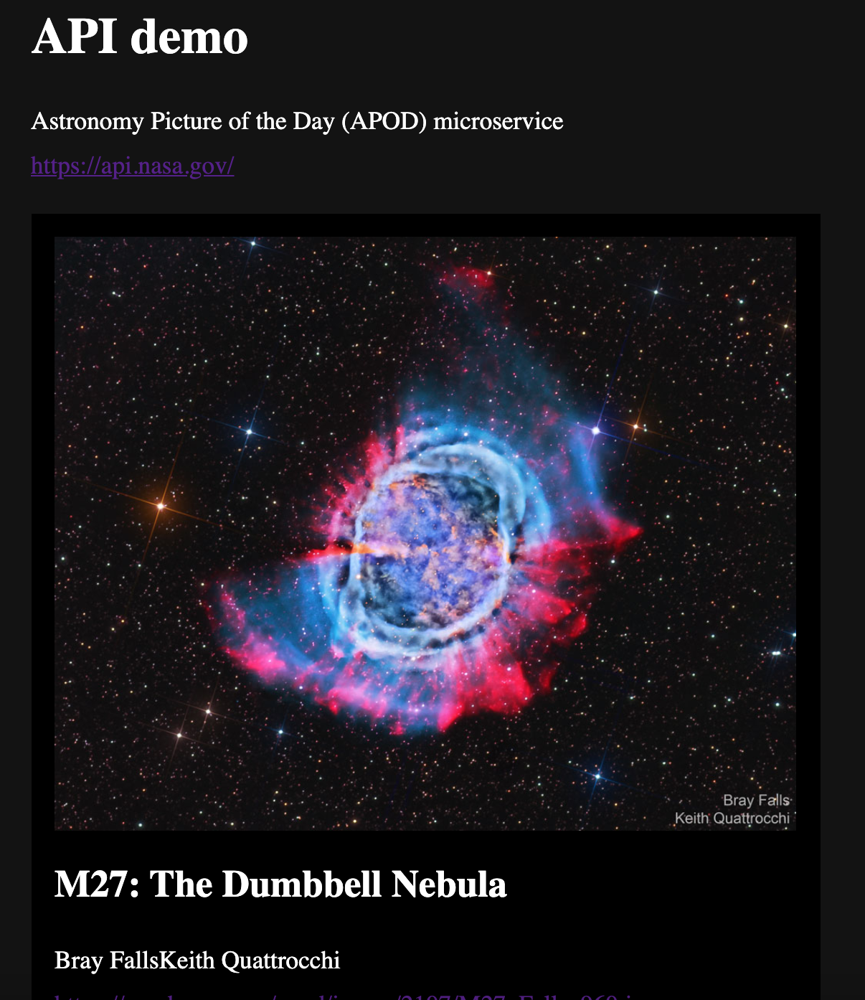

# API demo app

API data -> GUI

## Åpne lokalt

### Skaff API key

- registrer deg på https://api.nasa.gov/
- kopier API key

### Opprett .env-fil i root-folder

```
echo "API_KEY=[sett_inn_api_key]" > ".env"
```

Hvis API key er qwertyuiop:

```
echo "API_KEY=API_KEY=qwertyuiop" > ".env"
```

### Oppstart

```
npm install
node app
```

Evt. `nodemon app`

http://localhost:3000/


